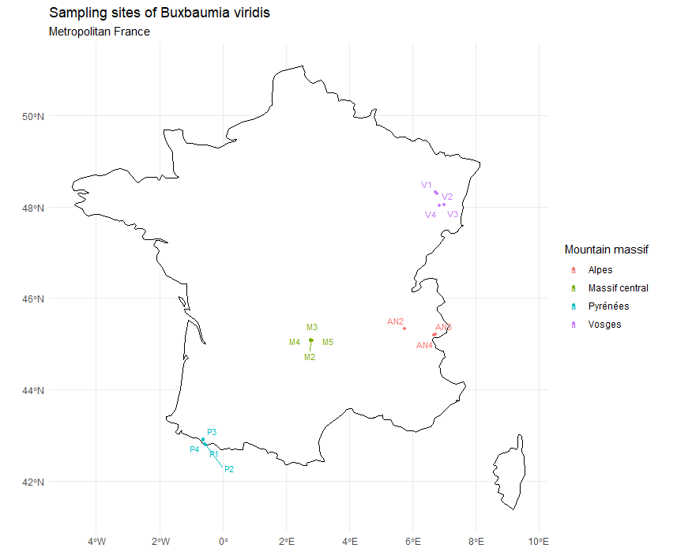
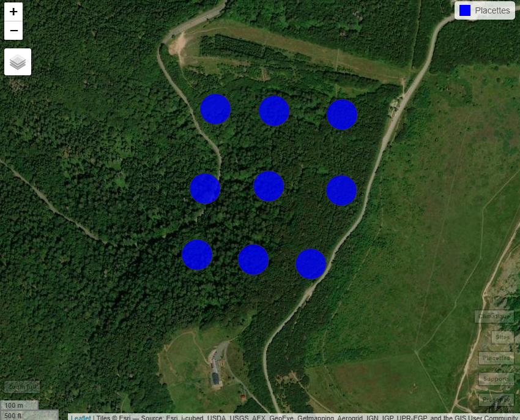
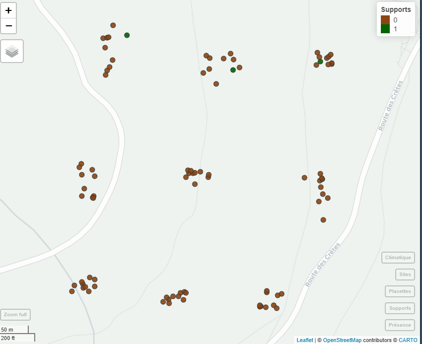
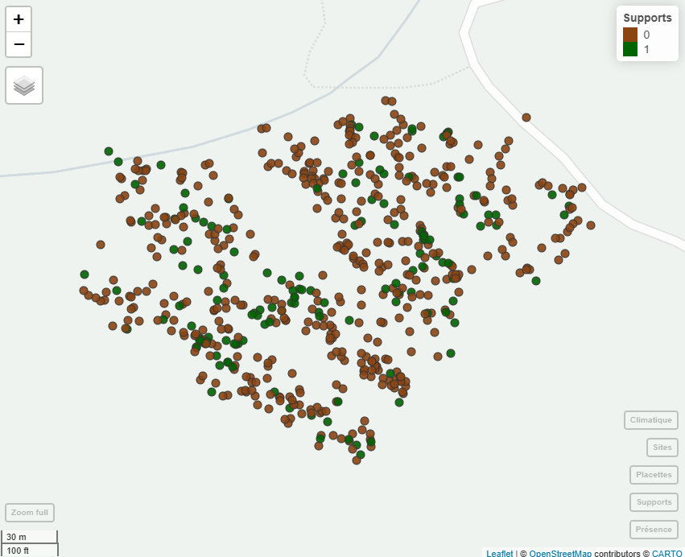
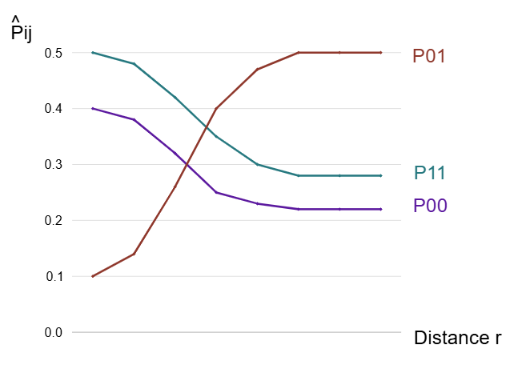
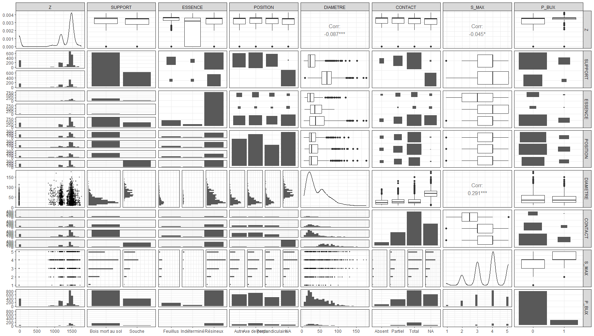
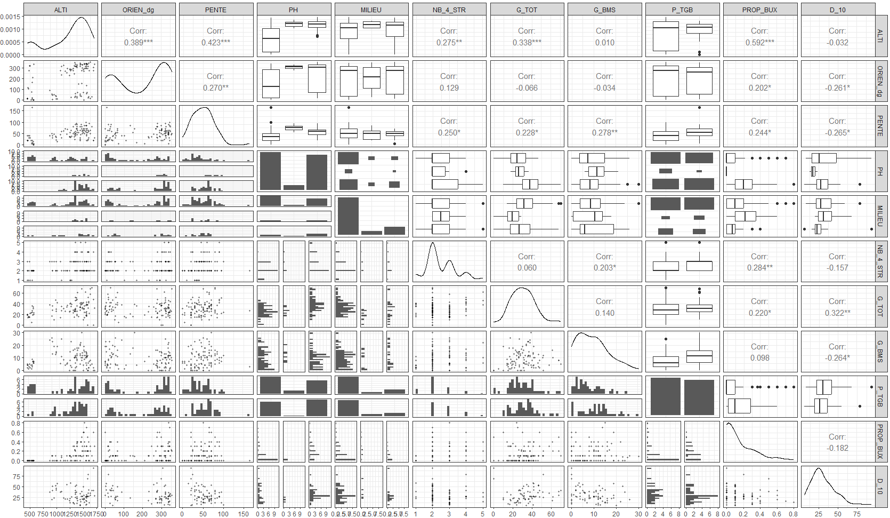

# Exploration des données de *Buxbaumia viridis,* problématiques, hypothèses et plan d'analyse

## 1 - Contexte

La Buxbaumie verte (*Buxbaumia viridis*) fait partie des rares Bryophytes protégées en France et en Europe (Directive Habitats, Annexe II (92/43/CEE) ; Convention de Berne, Annexe I ; ECCB 1995 (VU)). La bibliographie existante témoigne des connaissances de plus en précises sur l’écologie de cette espèce : saprolignicole circumboréale trouvant son optimum dans l’étage montagnard, inféodée majoritairement à l’alliance pionnière des bois morts en décomposition (Brewcyński *et al.*, 2021 ; Infante *et al.*, 2018).

Néanmoins, les connaissances mésologiques restent beaucoup plus lacunaires, en particulier les capacités de colonisation et de dispersion de l’espèce en forêt (Kropik *et al.*, 2020 ; Guillet *et al*., 2021). Ces notions sont essentielles pour le développement d'une réglementation précise pour la gestion forestière (Vottier & Vallée, 2017) .

Dans ce cadre, une campagne de collection de données relatives à *Buxbaumia viridis* a été menée de 2020 à 2021, visant à préciser son autoécologie et d’établir un lien avec la gestion forestière.

Cette étude a pour but d'apporter des éléments de réponse aux questions suivantes :

1.  *Quelles sont les variables mésologiques et climatiques influençant la dynamique des populations de Buxbaumia viridis ? Existe t-il des effets de seuil ?*

2.  *Quelles sont les capacités de dispersion de l’espèce et les modalités de son patron de dispersion ?*

**Nos principales hypothèses sont les suivantes :**

-   La forêt agit comme un tampon des variations de lumière, de température et d'humidité, ce qui permet de conserver des habitats stables du point de vue microclimatique. Cette stabilité est très importante, et doit durer dans le temps pour les espèces ayant des exigences écologiques fortes, telles que *Buxbaumia viridis*. Dès lors la structure du couvert forestier, et les modes de gestion de celle-ci, devraient beaucoup influencer la dynamique de la Buxbaumie :

    -   L'abondance de Buxbaumie augmente linéairement avec l'humidité. (%hygrometrie)

    -   L'abondance de Buxbaumie augmente avec l'ombrage, jusqu'à une certaine limite. En effet le sporophyte aurait besoin d'un quantité de lumière faible mais tout de même suffisante pour se developper. Un effet quadratique est attendu. (vérifier si interaction entre surafce terrière et humidité macro)

    -   L'abondance de la Buxbaumie augmente dans les zones gérées en futaie irrégulière.

<!-- -->

-   La bibliographie est unanime sur l'importance de l'abondance de bois mort au sol et de leur décomposition pour le développement de la Buxbaumie. Les modes de gestions pouvant également moduler cette abondance, il sera important de vérifier cet effet :

    -   L'abondance de Buxbaumie augmente linéairement avec la quantité de bois mort

    -   L'abondance de Buxbaumie augmente linéairement avec l'avancement de la saproxylation du bois mort

<!-- -->

-   La dispersion de la Buxbaumie à courte distance serait contrainte par le vent, faible en foret, ce qui limiterait la dispersion d'une génération à l'autre sur une distance de quelques mètres, tandis que la reproduction par bourgeonnement de gemmes ne permet pas de se disperser plus loin que le bois d'origine. Sans intervention de vecteurs de dispersions longue distance (faune), cette espèce est contrainte à se disperser de proche en proche. La connectivité du substrat joue alors un rôle majeur pour la dynamique de ces population, et les mesure de gestion de ces bois morts doivent en tenir compte :

    -   La buxbaumie est distribuée en agrégats

    -   La buxbaumie se retrouve surtout dans les zones ou les bois morts sont disposés en agrégats

**Protocole :**

L’échantillonage est mis en œuvre sous plusieurs contextes biogéographiques et mésoclimatiques à l’échelle de quatre massifs de montagne : Vosges, Alpes, Pyrénées et Massif Central.

{width="346"}

Deux protocoles différents ont été mis en place :

1.  Protocole Autoécologie/Mésologie (PAM) : phase en binôme mise en œuvre sur le massif des Vosges, des Alpes et des Pyrénées, qui a pour objectif de répondre aux questions des conditions mésologiques et climatiques influant sur la Buxbaumie (taux de colonisation notamment).

2.  Protocole Dispersion Locale (PDL): Une phase en équipe (6 personnes) destinée à étudier le paramètre de dispersion courte distance (échelle intra UG). Seuls les sites du Massif Central sont ciblés.

## 2 - Métadonnées

Les données sont séparées en 3 jeux distincts, correspondant à 3 échelles différentes. Un résumé des variables brutes est disponible en section 2.5.

### 2.1 - Sites

Le premier jeu de données permet surtout de positionner les sites d'échantillonage. Au total, 15 sites ont été échantillonés, soit 3 dans les Alpes, 4 dans les Vosges, 4 dans les Pyrénées et 4 dans le Massif Central.

*En italique, les variables calculables à cette échelle depuis les données brutes des placettes.*

```{r echo=FALSE, message=FALSE, warning=FALSE}
library(knitr)
library(dplyr)
library(kableExtra)
library(stringr)

setwd("C:/Users/pm83056/OneDrive - Office National des Forets/Bureau/Buxbaumia viridis/02 - Data/03 - Data frames")

sites <- read.csv("sites.csv") %>%
  select(-X.1)
placettes <- read.csv("placettes.csv") %>%
  select(-X.1)
supports <- read.csv("supports.csv") %>%
  select(-X.1)

setwd("C:/Users/pm83056/OneDrive - Office National des Forets/Bureau/Buxbaumia viridis/02 - Data/00 - Metadata")

Metadata_sites <- read.csv("01_1 - Metadata_sites.csv", header = TRUE, sep = ";")%>%
  select(Variable, Type, Signification)

add_modalities_with_counts <- function(metadata_df, data_df,
                                       var_col = "Variable",
                                       type_col = "Type",
                                       out_col = "Modalites") {

  qual_types <- c("Qualitatif", "0/1", "Semi-quantitatif")

  metadata_df %>%
    rowwise() %>%
    mutate(
      "{out_col}" := {
        v <- .data[[var_col]]
        t <- .data[[type_col]]

        # valeur par défaut
        res <- "-"

        # cas particuliers : on ne calcule jamais les modalités
        if (v %in% c("PLACETTE", "OBJ","DATE","Sites","SITE")) {
          res <- "-"
        } 
        else if (t %in% qual_types && v %in% names(data_df)) {

          x <- data_df[[v]]
          tab <- table(x, useNA = "no")

          if (length(tab) > 0) {
            res <- paste0(
              names(tab), " (", as.integer(tab), ")",
              collapse = " / "
            )
          }
        }

        res
      }
    ) %>%
    ungroup()
}
Metadata_sites <- add_modalities_with_counts(Metadata_sites, sites)

kable(Metadata_sites, format = "html", escape = FALSE) %>%
  kable_styling(full_width = FALSE) %>%
  row_spec(c(8:22), italic = TRUE, font_size = 11)
```

### 2.2 - Placettes

Pour le premier plan d'échantillonage (PAM), les sites sont échantillonés sur 9 placettes distinctes. Ce jeu de données donne des informations de structure sur la communauté sylvicole de chaque placette. Il sera possible de récupérer les **dates de dernière coupe** pour inférer la fréquence de gestion.

{width="399"}

*En italique, les variables calculables à cette échelle depuis les données brutes.*

```{r, echo = FALSE}
Metadata_placettes <- read.csv("01_2 - Metadata_placettes.csv", header = TRUE, sep = ";")%>%
  select(Variable, Type, Signification)

Metadata_placettes <- add_modalities_with_counts(Metadata_placettes, placettes)

kable(Metadata_placettes, format = "html", escape = FALSE) %>%
  kable_styling(full_width = FALSE) %>%
  row_spec(c(8,9,10,19,20,21,30,34,38,39), italic = TRUE, font_size = 11)
```

### 2.3 - Supports

Pour le PAM, 10 bois morts ont été échantillonés sur chaque placette. Pour le PDL, tous les bois morts de chaque site ont été échantillonés. En plus des informations de présence de la Buxbaumie, des caractéristiques physiques sur les supports ont été mesurées.

**PDL (Vosges ici) :**

{width="344"}

**PAM (Massif Central) :**

{width="349"}

*En italique, les variables calculables à cette échelle depuis les données brutes.*

```{r, echo = FALSE}
Metadata_supports <- read.csv("01_3 - Metadata_supports.csv", header = TRUE, sep = ";")%>%
  select(Variable, Type, Signification)

Metadata_supports <- add_modalities_with_counts(Metadata_supports, supports)

kable(Metadata_supports, format = "html", escape = FALSE) %>%
  kable_styling(full_width = FALSE) %>%
  row_spec(c(12,13,22:26), italic = TRUE, font_size = 11)

```

### 2.4 - Données climatiques

A faire

### 2.5 - Liste des variables brutes

Toutes les variables brutes sont listées ici. Les variables désignées comme explicatives dans la bibliographie sont indiquées en gras.

```{r, echo = FALSE}
Metadata_raw <- read.csv("Metadata_raw_variables.csv", header = TRUE, sep = ";")

kable(Metadata_raw, format = "html", escape = FALSE) %>%
  kable_styling(full_width = FALSE) %>%
  row_spec(c(3,5,6,7,8,10,11,14,15,17,19,20,23), bold = TRUE)

```

### 2.6 Variables explicatives selon la bibliographie

La liste suivante permet de faire correspondre les variables aux informations d'autoécologie de *Buxbaumia viridis* évoquées dans la littérature. Les variables présentes dans nos données brutes sont en [**rouge**]{style="color:#CF3827;"}, les variables calculables à partir de nos données brutes sont en [**bleu**]{style="color:#4C81A6;"} et les variables pouvant être acquises hors du protocole sont en [**vert**]{style="color:#5B9951;"}.

**Forêt / structure du peuplement**

-   Forêts de conifères montagnardes ou mixtes, souvent à sapin, épicéa et hêtre, (Philippe, 2004; Brewczyński, 2021; Offerhaus, 2019) [**essences dominantes**]{style="color:#CF3827;"}, [**association phytosociologique**]{style="color:#CF3827;"}

-   Couvert forestier relativement fermé mais avec canopée partiellement ouverte, créant un ombrage diffus (le nombre de sporophytes augmente significativement avec une plus grande ouverture de la canopée, suggérant que la lumière pourrait être un facteur déclenchant leur développement), (Offerhaus, 2019; Spitale, 2015; Guillet, 2021) [**surface terrière**]{style="color:#CF3827;"}, [**stratification**]{style="color:#CF3827;"}, [**date de la dernière coupe**]{style="color:#5B9951;"}

-   Forte surface terrière / structure forestière fermée favorisant l’humidité, (Vottier & Vallée, 2017; Spitale, 2015) [**surface terrière**]{style="color:#CF3827;"}, [**stratification**]{style="color:#CF3827;"}, [**date de la dernière coupe**]{style="color:#5B9951;"}

**Microclimat et topographie**

-   Humidité élevée ou très élevée de l’air et du substrat (Brewczyński, 2021), [**thermohygromètre**]{style="color:#CF3827;"}

-   Proximité de ruisseaux, sources, zones suintantes (Brewczyński, 2021), [**distance au cours d’eau le plus proche**]{style="color:#5B9951;"}

-   Précipitations annuelles élevées et microclimat stable, frais et humide (Spitale, 2015) [**données météo locale**]{style="color:#5B9951;"} → Les populations sont très fluctuantes et elles dépendent étroitement des précipitations entre Mai et Juin (Wiklund 2004). Possibilité de mettre cette variable comme effet aléatoire dans le modèle?

-   Pentes fortes, versants nord et vallées encaissées modulant le microclimat (Spitale, 2015; Deme, 2020), [**pente**]{style="color:#CF3827;"}, [**northness**]{style="color:#4C81A6;"}

-   Altitude montagnarde à subalpine (Guillet, 2021) , [**altitude**]{style="color:#CF3827;"}

**Substrat et microhabitat**

-   Abondance de bois mort bien décomposé (classes avancées IV–V) comme substrat principal des sporophytes, (Guillet, 2021; Spitale, 2015; Brewczyński, 2021; Offerhaus, 2019) étendue de la surface du sol couverte par le bois mort → [**surface terrière des bois morts**]{style="color:#CF3827;"} / [**nombre de bois mort par unité de surface**]{style="color:#4C81A6;"} / [**D10**]{style="color:#CF3827;"} , [**stade de saproxylation**]{style="color:#CF3827;"}

-   Bois de résineux, en particulier Abies alba, mais aussi Picea abies et autres essences, (Brewczyński, 2021; Philippe, 2004; Offerhaus, 2019) [**essences principales**]{style="color:#CF3827;"}, [**essence du support**]{style="color:#CF3827;"}

-   Fragments de bois mort de petite taille, (Brewczyński, 2021) [**diamètre**]{style="color:#CF3827;"} ou [**classe de taille du support**]{style="color:#4C81A6;"}, [**GBMS**]{style="color:#CF3827;"}

-   Faible recouvrement par d’autres bryophytes sur le bois, substrat partiellement nu (Offerhaus, 2019; Spitale, 2015). Le recouvrement et la compétition sont plus intenses sur les bois de grande taille, et sur les parties supérieures (Odor, 2002 ; Jansova, 2006), [**localisation de la Buxbaumie sur le support**]{style="color:#CF3827;"}, [**diamètre du BMS**]{style="color:#CF3827;"}

-   Les mousses dioïques telles que B. viridis ont tendance à se retrouver sur les troncs avec un faible degré d’adhérence au sol. (Zarnowiec 2021) [**contact du tronc au sol**]{style="color:#CF3827;"}

-   Substrat acide (Deme, 2020) [**pH du sol**]{style="color:#CF3827;"}

**Luminosité**

-   Lumière diffuse, ombre partielle ou marquée, souvent sous canopée ouverte mais non claire, (Offerhaus, 2019; Deme, 2020; Guillet, 2021, Philippe, 2004; Spitale, 2015) [**luxmètre**]{style="color:#CF3827;"}

**Gestion forestière et perturbations**

-   Forêts gérées avec interventions sylvicoles récentes augmentant la disponibilité en bois mort (Brewczyński, 2021; Deme, 2020; Offerhaus, 2019), [**date de la dernière coupe**]{style="color:#5B9951;"}

-   Sensibilité aux pratiques réduisant le couvert, l’humidité ou le bois mort très décomposé (Spitale, 2015; Vottier & Vallée, 2017), [**type de gestion de coupe**]{style="color:#5B9951;"}

**Variables liées au cycle de vie et aux interactions biotiques**

-   Co‑occurrence avec bryophytes terricoles ou épixyliques acidophiles type Nowellia curvifolia (Deme, 2020; Offerhaus, 2019; Lohmus, 2025), [**données de diversité bryologiques locales**]{style="color:#5B9951;"}

## 3 - Dispersion et analyses spatiales

### 3.1 Description des enjeux

Pour analyser la dispersion locale, on utilisera les données du PDL, donc seulement dans le massif Central. A noter qu'ici on travaille sur la présence/absence de Buxbaumie sur l'ensemble des bois morts d'un site. Le processus ponctuel se base sur les bois morts. On va donc traiter les données comme des points associés à une valeur binaire (0/1) de présence-absence. Il est important de noter également que seul le stade sporophytique a été relevé. Il a été montré que le stade protonémal a une répartition plus large que le sporophyte, grâce à une tolérance écologique plus large et des capacités de reproduction asexuée par bourgeonnement (Guillet *et al.*, 2021). Il est possible que certains supports déclarés comme ne portant pas Buxbaumia, portent en réalité seulement des individus haploïdes. Cette précision est d'autant plus importante qu'il a été démontré que la dispersion de cette espèce ne se fait pas seulement par les spores mais également par les propagules végétatives (gemmes des rhizoïdes) (Kropik *et al.*, 2020). Enfin nous diposons aussi de données sur la position des individus de Buxbaumia sur les supports.

A ce jour, les vecteurs de dispersion connus pour cette espèce sont le vent (facilité par la pluie) pour les spores, ainsi que la zoochorie pour les spores et propagules (Kropik *et al.*, 2020 ; Puntillo & Puntillo, 2024).

Le caractère saprolignicole de cette espèce implique que les caractéristiques locales du bois mort ont une influence majeure sur sa capacité à coloniser un milieu (Ódor & Standovár, 2002). Ces caractéristiques peuvent concerner la nature du bois mort (essence, souche ou BMS), la répartition spatiale (densité locale des bois morts) et l'état physique (taille, position par rapport au sol, niveau d'avancement de la saproxylation) (Spitale & Mair, 2015 ; Guillet *et al.*, 2021 ; Holá *et al.*, 2014 ; Brewcyński *et al.*, 2021).

Il sera important de récléchir à la possibilité d'étudier seulement des bois mort considérés comme "favorables" à l'installation de la Buxbaumie, en se basant sur les stades de saproxylation. En effet un support non colonisé avec un état de décomposition peu avancé ne porte pas la même information qu'un support non colonisé très décomposé.

D'autres caractéristiques locales telles que la pente ou l'exposition du versant peuvent influencer la capacité d'implantation (Guillet *et al*., 2021 ; Deme *et al*., 2020).

Les questions scientifiques générales liées à la dispersion sont :

1.  Comment sont structurés les patrons de dispersion de *Buxbaumia viridis ?*

2.  Quelles sont les modalités de ces patrons de dispersion ?

### 3.2 Questions et hypothèses

Ces hypothèses ne sont pas définitives et nécessitent d'être retravaillées / repensées.

**Structure spatiale des patrons de dispersion**

[Q1]{.underline} : Les bois morts portant Buxbaumia sont-ils plus proches les uns des autres que prévu par le patron des supports ?

-   Hypothèse H0 : La présence de Buxbaumia suit uniquement la distribution des supports.

-   Hypothèse H1 : Les présences sont clusterisées au-delà de ce que le patron des supports suggère, indiquant une dispersion locale effective.

**Influence de l’habitat sur la colonisation (redondant avec la 2e partie?)**

[Q2]{.underline} : Quelles caractéristiques locales des bois morts influencent la probabilité de colonisation par Buxbaumia ?

-   Hypothèse H0 : La probabilité de colonisation ne dépend pas des caractéristiques locales des bois morts (essence, état de décomposition, taille, position, saproxylation).

-   Hypothèse H1 : La probabilité de colonisation dépend de ces caractéristiques : certains types de bois ou états de décomposition favorisent la présence.

[Q3]{.underline} : Les variables topographiques ou microclimatiques (pente, exposition) influencent-elles la probabilité de colonisation ?

-   Hypothèse H0 : L’environnement local n’a pas d’effet sur la colonisation.

-   Hypothèse H1 : La colonisation est favorisée (ou limitée) selon la pente, l’exposition...

**Processus de dispersion locale**

[Q4]{.underline} : Existe-t-il un effet de voisinage ou de dispersion locale (propagules, spores, micro-zoochorie) non expliqué par l’habitat ?

-   Hypothèse H0 : La distribution des présences est entièrement expliquée par l’habitat et la distribution des supports.

-   Hypothèse H1 : Il existe une autocorrélation spatiale résiduelle, indiquant une dispersion locale additionnelle entre supports.

### 3.3 Idées d'analyse

Pour décrire un patron de dispersion avec des données ponctuelles, on devra savoir si les points ont une structure agrégée, aléatoire ou uniforme (H0 : la distribution des présences est indépendante de la distribution des variables environnementales). Pour cela, on utilise généralement la fonction K de Ripley. L'inconvénient est que cette fonction part de l'hypothèse que les données suivent un processus de poisson homogène, ce qui n'est probablement le cas de nos données. En effet, il semble peu pertinent d'inférer l'aggrégation des individus de Buxbaumie par l'aggrégation des bois morts portant la Buxbaumie (variable probablement corrélée à l'aggrégation des supports, indépendante des processus de dispersion de l'espèce d'interêt).

Il sera tout de même pertinent de commencer par décrire l'habitat, soit le patron spatial des supports, et des supports portrant uniquement la Buxbaumie (Kernel de densité des bois morts, G de Ripley).

On pourra compléter avec un Mark Connection Function. Le MCF mesure à quelle distance les marques identiques (ex : présence de Bux) sont plus ou moins associées que ce à quoi on s’attendrait compte tenu du pattern spatial des supports. En comparant les valeurs de marquage des supports à chaque distance, la fonction teste si les colonisations clusterisent plus que les supports eux mêmes. On répondra donc à la question : Les bois morts qui portent Buxbaumia tendent-ils à se trouver proches les uns des autres ?

*L'algorithme va, pour chaque distance r :*

-   *Sélectionner toutes les paires de points dont la distance est proche de r (proche car il y a un petit seuil de tolérance appelé bandwith, noté h ; Stoyan and Stoyan 1994).*

-   *Parmi les paires ainsi formées, il compte le nombre de paires de chaque : N[0,0] ; N[1,0] ; N[1,1]*

-   *P01 par exemple va etre calculé comme N[0,1]/la somme des N à ce r*

Dans le cas d'un aggrégation des bois portant buxbaumia, on aura des couples 1-1 fréquents à courte distance. On s'attend alors à ce genre de sortie pour le MCF :

{width="268"}

Pour les modalités de dispersion, il sera possible de faire un modèle incluant les variables mésologiques. On pourra notamment faire un modèle de processus ponctuel PPM (spatstat), dans lequel l’intensité locale de présence est modélisée en fonction des caractéristiques du bois mort et des variables topographiques ou microclimatiques. Ce type de modèle permet de tester directement l’effet de l’habitat sur la probabilité de colonisation, en tenant compte du fait que les points ne sont définis que sur les supports.

ppm(formule = présence_Bux \~ essence + décomposition + taille + position + pente + exposition, Poisson())

L’intensité de présence est modélisée en fonction des caractéristiques locales. Cela permet de tester l’effet de l’habitat tout en prenant en compte la distribution des supports. Il sera possible d'inclure dans le modèle de l'intercation spatiale entre les points, dans le cas ou on aura détecté une aggrégation par exemple (Gibbs –\> Strauss ou Geyer [Lab 10: Gibbs processes \| testWorkshop](https://spatstat.org/testWorkshop/solutions/solution10.html)).

Une fois ce modèle ajusté, l’analyse des résidus spatiaux (via un variogramme ou un Moran I) permettra de vérifier s’il subsiste un signal spatial non expliqué par les covariables. La présence d’une autocorrélation résiduelle indiquerait qu’un processus biologique supplémentaire intervient, en particulier un effet de voisinage lié à des mécanismes de dispersion locale (gemmes, effet pluie ou micro-zoochorie).

## 4 - Autoécologie

### 4.1 Description des enjeux

Pour analyser les préférences écologiques et mésologiques du sporophyte, on utilisera les données du PAM, dans les Vosges, les Alpes et les Pyrénées. On dispose de données à l'échelle de la placette (données sur les caractéristiques et la structure forestière du milieu), et à l'échelle du support ( mêmes variables que pour le PDL ). Il est important de signaler que les données de saproxylation n'ont pas été relevées dans les Alpes comme le prévoyait le protocole. Cette contrainte

### 4.2 Questions et hypothèses

**Variations mésologiques à l’échelle des placettes et supports**

[Q1 :]{.underline} Quelles variables mésologiques influencent la probabilité de présence de Buxbaumia ?

-   Hypothèse H0 : La probabilité de présence ne dépend pas des variables mésologiques locales (taille du bois mort, saproxylation, essence, position…).

-   Hypothèse H1 : Certaines caractéristiques locales favorisent la présence de Buxbaumia, par exemple :

    -   supports très décomposés ou de certaines essences favorisent l’implantation ;

    -   les très gros bois peuvent limiter ou favoriser la présence selon l’espèce.

[Q2 :]{.underline} L’effet des variables mésologiques est-il constant ou varie-t-il selon les sites et massifs ?

-   Hypothèse H0 : L’effet des covariables est le même sur tous les sites et massifs.

<!-- -->

-   Hypothèse H1 : L’effet de certaines covariables varie selon le site ou le massif (pente, microclimat, exposition…).

[Q3 :]{.underline} Les interactions entre variables mésologiques influencent-elles la colonisation ?

-   Hypothèse H0 : Les variables agissent de manière additive.

<!-- -->

-   Hypothèse H1 : Certaines combinaisons de variables (ex : exposition × humidité, taille du bois × saproxylation) modifient la probabilité de présence.

**Échelle du support : présence / absence sur chaque bois mort**

[Q4 :]{.underline} Le taux de colonisation au sein d’une placette reflète-t-il l’effet des caractéristiques locales ?

-   Hypothèse H0 : Le nombre de supports colonisés est indépendant des variables locales.

<!-- -->

-   Hypothèse H1 : Le taux de supports colonisés varie en fonction des caractéristiques des bois (taille, saproxylation, essence, microclimat).

**Effets hiérarchiques et structuration spatiale**

[Q5 :]{.underline} Les variations régionales ou locales (Massif / Site / Placette) influencent-elles la présence ?

-   Hypothèse H0 : Il n’y a pas d’effet hiérarchique : Massif, Site et Placette n’influencent pas la colonisation au-delà des covariables mesurées.

<!-- -->

-   Hypothèse H1 : La présence varie selon Massif / Site / Placette indépendamment des covariables (justifiant les effets aléatoires).

### 4.3 Idées d'analyse

L'objectif est de construire ici des modèles de présence de la Buxbaumie en fonction de différentes conditions mésologiques aux sites. Les données sont imbriquées dans une structure hiérarchique (Massif/Site/Placette). Nous ne nous intéressons ici qu'aux variations très locales des conditions environnementales. Pour éviter que les vairations environnementales régionales interfèrent dans nos variables d'interet, il faudra impérativement intégrer cette structure hiérarchique comme effet aléatoire. Aussi, le choix d'une approche GLMM binomial semble plus appropriée, en particulier sur des données de présence / absence. Pour une analyse à l'échelle des placettes, on integrera les effets aléatoires :

$$
P_{\text{Bux}} \sim \text{variables env} \; (1 \mid \text{Massif/Site})
$$

Pour une analyse à l'échelle du support on ajoutera l'effet placette :

$$
P_{\text{Bux}} \sim \text{variables env} \; (1 \mid \text{Massif/Site/Placette})
$$

Il faudra également déterminer si l'effet d'une covariable change selon le groupe, auquel cas :

$$
P_{\text{Bux}} \sim \text{X1 + X2 + X3} \; (1 + \text{X3} \mid \text{Massif/Site/Placette})
$$

Enfin on pourra inclure l'interaction des covariables environnementales entre elles :

$$
P_{\text{Bux}} \sim \text{X1 + X2 + X3 + X2*X3 } \; (1 \mid \text{Massif/Site/Placette})
$$

Il sera peut être intéressant de vérifier si les effets changent selon les massifs.

Il sera impératif de contrôler la colinéarité écologique des variables mésologiques :

-   taille du bois mort ↔ niveau de saproxylation

-   exposition ↔ microclimat ↔ humidité

A noter que la présence de la Buxbaumie ($P_{\text{Bux}}$ ) peut être approchée par :

-   A l'échelle du support : la présence / absence sur les supports

-   A l'échelle des placettes : la présence / absence sur les supports sur les placettes, ou le taux de supports colonisés par placette

A voir aussi comment intégrer l'effet observateur (pourcentage de non-détection?).

**L'analyse se fera dans cet ordre :**

-   sélection des variables par pertinence écologique (bibliographie)

-   sélection des variables par pertinence structurelle (corrélations, exhaustivité)

-   Construction de modèles concurrents en partnat du modèle null (comparaison par AIC)

### 4.4 Sélection bibliographique des variables

Les variables suivantes ont été sélectionnées car elles peuvent permettre d'inférer des processus supposés influençer la Buxbaumie verte d'après la bibliographie. Certaines variables sont précisement celles utilisées dans d'autres études, mais la plupart sont des proxys.

-   **Structure du peuplement :**

    -   essences dominantes

    -   association phytosociologique

    -   surface terrière

    -   stratification

    -   date de la dernière coupe (à acquérir)

<!-- -->

-   **Microclimat et topographie :**

    -   thermohygromètre / luxmètre

    -   pente

    -   altitude

    -   northness (à calculer)

    -   distance au cours d'eau le plus proche (à acquérir)

    -   données météo locales (à acquérir)

<!-- -->

-   **Substrat et microhabitat :**

    -   surface terrière des bois morts

    -   D10

    -   stade de saproxylation

    -   essences principales

    -   essence du support

    -   diamètre

    -   GBMS

    -   localisation de la Buxbaumie sur le support

    -   diamètre du BMS

    -   contact du tronc au sol

    -   pH du sol

    -   Nombre de bois mort par unité de surface (à calculer)

    -   classe de taille du support (à calculer)

<!-- -->

-   **Gestion forestière / perturbations :**

    -   date de la dernière coupe (à acquérir)

    -   type de gestion de coupe –\> intensité, fréquence (à acquérir)

<!-- -->

-   **Interaction biotiques :**

    -   données de diversité bryologiques locales (à acquérir)

### 4.6 Correlations

**Supports :**



**Placettes :**



## 5 - Données climatiques

A faire
